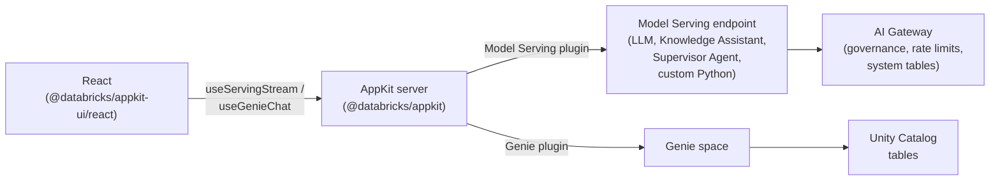

# What is Agent Bricks?

**Agent Bricks** is Databricks' enterprise agent platform for building, deploying, and governing agents that operate on your business data. It unifies model access, execution, governance, and context across a single system: from the model you call, to the data your agent reads, to the identity it acts under. In your workspace you configure Knowledge Assistants, Multi-Agent Supervisors, and custom Python agents. Databricks handles evaluation, tuning, and quality improvement, then hosts each agent at an HTTP endpoint your app can call.

Your AppKit app connects to Agent Bricks capabilities through two plugins: the [Model Serving plugin](/docs/appkit/v0/plugins/serving) for agents, foundation models, and governed endpoints, and the [Genie plugin](/docs/appkit/v0/plugins/genie) for natural-language queries over Unity Catalog tables.

## How it fits together

Your AppKit app calls Agent Bricks through a **Model Serving endpoint** (a foundation model, Knowledge Assistant, Agent Bricks Multi-Agent Supervisor, or custom Python agent) or a **Genie space** (natural-language queries over Unity Catalog tables). The [Model Serving plugin](/docs/appkit/v0/plugins/serving) and [Genie plugin](/docs/appkit/v0/plugins/genie) cover both.

## AppKit plugins for Agent Bricks

| You want to                                                                   | Use this plugin | Frontend helper                        |
| ----------------------------------------------------------------------------- | --------------- | -------------------------------------- |
| Call a foundation model (LLM) with chat messages                              | `serving`       | `useServingStream`, `useServingInvoke` |
| Call an agent endpoint (Knowledge Assistant, Supervisor Agent, custom Python) | `serving`       | `useServingStream`, `useServingInvoke` |
| Give users natural-language queries over Unity Catalog tables                 | `genie`         | `GenieChat`, `useGenieChat`            |

Pick the plugin that matches the resource. No other primitive is required for the AI surface.

## Auth

Serving and Genie HTTP routes run on behalf of the authenticated user by default. If the user doesn't have `CAN QUERY` on the serving endpoint or `CAN RUN` on the Genie space, the call fails with a 403. You don't write the permission check.

For server logic outside a route handler, call `AppKit.serving("alias").asUser(req).invoke(...)` to keep the same behavior.

## Why AppKit instead of raw `fetch`

You could call a serving endpoint directly with `fetch` and a token. The plugin isn't doing something you can't do yourself. It's doing these things so you don't have to:

- **Per-user permissions for free.** Both the Model Serving plugin and Genie plugin routes run as the authenticated user by default. Your users only see endpoints and data they are already allowed to see. No OAuth code on your side. See [Execution context](/docs/appkit/v0/plugins/execution-context) for the details.
- **Streaming plumbing done.** SSE parsing, abort on unmount, token accumulation, error handling. `useServingStream` and `useGenieChat` handle these.
- **No secrets in the frontend.** The plugin proxies through your server. Tokens stay on the backend. No PAT in the React bundle.
- **Typed endpoint aliases.** If your serving endpoint publishes an OpenAPI schema, AppKit generates TypeScript types for request and response per alias. Autocomplete for chunk shapes, not `unknown`.

:::note[Authoring a custom agent]

Authoring a custom agent from scratch is a Python workflow: the `ResponsesAgent` interface, an agent framework (OpenAI Agents SDK, LangGraph, LlamaIndex), and MLflow for tracing. See [Create an AI agent](https://docs.databricks.com/aws/en/generative-ai/agent-framework/create-agent) on docs.databricks.com for that track.

:::

## Pick a template to start from

Start from a template that matches your use case. Each one includes the Model Serving or Genie plugin wiring, an `app.yaml` resource binding, and a working UI you can adapt.

| You want to...                                     | Template                                                   |
| -------------------------------------------------- | ---------------------------------------------------------- |
| Add a streaming chatbot to your app                | [AI Chat App](/templates/ai-chat-app)                      |
| Let users query tables in natural language         | [Genie Analytics App](/templates/genie-analytics-app)      |
| Add multi-space Genie switching to an existing app | [Genie Multi-Space Selector](/templates/genie-multi-space) |

## Where to next

- [AI Gateway](/docs/agents/ai-gateway) for governed access to models, agent endpoints, and external tools.
- [Genie spaces](/docs/agents/genie) for chat-with-your-data over Unity Catalog tables.
- [Custom agent endpoints](/docs/agents/custom-agents) for wiring Knowledge Assistant, Supervisor Agent, or your own Python agent.
