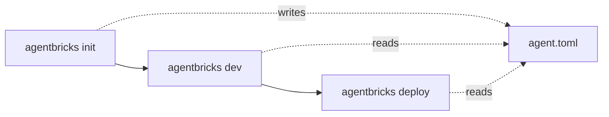

# Agent Bricks CLI

:::note[Experimental]

The Agent Bricks CLI and the custom agent APIs it uses are experimental. Commands and behavior can change.

:::

The Agent Bricks CLI (`agentbricks`) is a Databricks command-line tool for building and deploying custom agents. The `databricks-agentbricks` package installs the `agentbricks` command and the AgentKit Python SDK, and manages memory, sessions, tracing, tools, and deployments from one authenticated command.

## The agent lifecycle

The `agentbricks` CLI scaffolds a local directory of deployable agent code from a framework template, with the runtime, tests, and an optional chat UI already wired up. You write the application logic (model, tools, and prompts), and the CLI handles running it locally and deploying it to Databricks infrastructure.

`agent.toml` is the declarative source of truth for all Databricks-managed resources your agent depends on: tool bindings (data sandbox, managed MCP services, Genie, Unity Catalog functions), and memory, session, and durability resources. `agentbricks deploy` reads it to provision and wire everything up, so the file, not hand-written setup code, is what deploys.

Three commands take an agent from a blank directory to production:

- **`agentbricks init`** scaffolds the project from a framework template, declares default memory and session stores in `agent.toml`, and optionally seeds a `.env` file with a Databricks profile so the project runs immediately with `agentbricks dev`.
- **`agentbricks dev`** runs the agent locally using the same manifest and environment that the deployment uses, so local behavior matches what ships. It connects the agent to Databricks model serving and traces to a local MLflow server.
- **`agentbricks deploy`** reads `agent.toml` to provision any declared-but-missing stores, grants the agent's service principal access to them, configures tracing, and rolls out the deployment as a Databricks App. When the deployment finishes, the CLI returns the URL of your running agent.



:::note

You can add tools and bind memory and session stores at any time, not only at init. Use `agentbricks tools add`, `agentbricks memory bind`, and `agentbricks sessions bind` to update your agent configuration between any of these steps.

:::

## Capabilities

| Capability           | Description                                                                                                                                                                                                                                                                                                                                |
| -------------------- | ------------------------------------------------------------------------------------------------------------------------------------------------------------------------------------------------------------------------------------------------------------------------------------------------------------------------------------------ |
| **Model access**     | The CLI provisions model access so your agent can call a Databricks-served model through the AI Gateway without managing credentials or endpoints. See [Foundation Model APIs](https://docs.databricks.com/aws/en/machine-learning/foundation-model-apis/).                                                                                |
| **Managed memory**   | Durable facts, preferences, and decisions that an agent recalls in later, separate conversations, retrieved by semantic search and partitioned by actor. See [Managed agent memory](https://docs.databricks.com/aws/en/agents/agent-memory/managed-memory).                                                                                |
| **Managed sessions** | An agent's session state for one interaction, most commonly the conversation transcript, held in managed session stores and partitioned by actor, with support for forking a session into an independent branch. See [Managed agent sessions](https://docs.databricks.com/aws/en/agents/agent-memory/managed-sessions).                    |
| **Tools**            | Databricks-managed capabilities declared in `agent.toml`: a downscoped Unity Catalog sandbox, a managed MCP service, a Genie Space, or a Unity Catalog function. Write custom Python tools directly in the project code. See [Databricks-provided MCP servers](https://docs.databricks.com/aws/en/agents/mcp-tools/built-in-mcp-services). |
| **Tracing**          | MLflow tracing that is on by default, routing each run's traces to a per-project MLflow experiment for debugging and monitoring. See [MLflow Tracing](https://docs.databricks.com/aws/en/mlflow3/genai/tracing/).                                                                                                                          |
| **Deployment**       | Deploys an agent to the Databricks agent runtime, grants the agent's service principal access to bound stores, and manages the deployment lifecycle.                                                                                                                                                                                       |

## Quickstart

This quickstart takes you from an empty directory to a deployed custom agent.

### Prerequisites

- The [Databricks CLI](/docs/tools/databricks-cli), installed and [authenticated](/docs/tools/databricks-cli#authenticate) to your workspace (needed for browser-based `agentbricks login`).
- Python 3.10 or above.
- [`uv`](https://docs.astral.sh/uv/), used to scaffold, run, and deploy the agent.
- Install the Agent Bricks CLI:

  ```bash
  pip install databricks-agentbricks
  ```

### Step 1: Authenticate with OAuth and save a profile

The CLI uses Databricks CLI authentication. Authenticate to your workspace with OAuth (user-to-machine) and save the credentials as a named profile.

To start the OAuth flow, run the following, replacing the host with your workspace URL. The command opens a browser to complete sign-in, then writes the profile to `~/.databrickscfg`:

```bash
databricks auth login --host https://<your-workspace-url> --profile <profile>
```

To set that profile as the CLI's default so later commands can omit `--profile`, run the following:

```bash
agentbricks login --profile <profile>
```

`agentbricks login` validates the profile's credentials. If they are missing or rejected, it reruns `databricks auth login` and retries.

### Step 2: Scaffold the agent project

Scaffold a new agent project, and pass `--framework` to choose the template. This example uses the LangGraph template, which includes a browser chat app:

```bash
agentbricks init --framework langgraph my-agent
cd my-agent
```

`agentbricks init` writes the project's managed resources and tool bindings to `agent.toml`, and declares a default memory store and session store named from the project, so the deployed agent has long-term memory and durable conversation history. Pass `--framework openai` instead to scaffold an OpenAI Agents project. To scaffold the API-only backend without the chat app, add `--disable-chat-app`.

To point the agent at stores you already have instead of the defaults, bind them explicitly:

```bash
agentbricks sessions bind my-existing-sessions
agentbricks memory bind my-existing-memory
```

Binding edits `agent.toml` only; `agentbricks deploy` creates any declared-but-missing store.

### Step 3: Run the agent locally

Run the agent on your machine to test it before you deploy.

```bash
agentbricks dev
```

This starts a local server on port 8000, wrapping the Databricks Apps local runtime so local behavior matches a deployment. The CLI connects the agent to the Unity AI Gateway so it can call the model locally. By default, the agent uses the `system.ai.claude-sonnet-4-5` model. To use a different model, edit the `MODEL` value in `agent/agent.py`.

Open the pre-generated chat UI at `http://localhost:8000` to interact with the agent. The UI includes a link to the run's MLflow experiment, where you can view traces.

### Step 4: View tracing

Tracing is on by default. `agentbricks init` binds a default per-project MLflow experiment, so `agentbricks dev` and `agentbricks deploy` send traces automatically with nothing to set up.

To list traces after your agent has produced some, run the following:

```bash
agentbricks tracing list
```

To pin a specific MLflow experiment, run `agentbricks tracing bind --experiment-name <name>` or `agentbricks tracing bind --experiment-id <id>`. To stop tracing, run `agentbricks tracing unbind`.

### Step 5: Deploy the agent

Deploy the agent to the Databricks agent runtime. The CLI provisions the agent's memory and session stores if they aren't already provisioned, grants the agent's service principal access to them, and rolls out the deployment. The deployed app is named `agent-bricks-<name>`.

```bash
agentbricks deploy my-agent
```

When the deployment finishes, the CLI returns the deployment's URL. Open that URL to interact with your live agent, which is automatically connected to the Unity AI Gateway. To manage the deployment afterward, use the `agentbricks deployments` commands, such as `agentbricks deployments logs` and `agentbricks deployments stop`.

## Command reference

For the full, up-to-date command reference, including every command, argument, and flag, see [`cli.md`](https://github.com/databricks/databricks-ai-bridge/blob/main/integrations/agentbricks/cli.md) in the [`databricks-ai-bridge` repo](https://github.com/databricks/databricks-ai-bridge/tree/main/integrations/agentbricks).

## Where to next

- [Databricks CLI](/docs/tools/databricks-cli) to install and authenticate the CLI that `agentbricks` builds on.
- [Agent Bricks CLI README](https://github.com/databricks/databricks-ai-bridge/blob/main/integrations/agentbricks/README.md) for the AgentKit SDK, the durable runtime, and full command reference.
