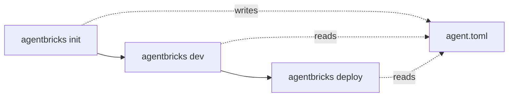

# Agent Bricks CLI

:::note[Experimental]

The Agent Bricks CLI and the custom agent APIs it uses are experimental. Commands and behavior can change.

:::

The Agent Bricks CLI (`agentbricks`) is a Databricks command-line tool for building and deploying custom agents. The `databricks-agentbricks` package installs the `agentbricks` command and the AgentKit Python SDK, and manages memory, sessions, tracing, tools, and deployments from one authenticated command.

To get an agent running in a few commands, see the [Agent Bricks quickstart](/docs/agents/quickstart). This page covers each step in detail, for a new agent or for one you already built.

## The agent lifecycle

The `agentbricks` CLI scaffolds a local directory of deployable agent code from a framework template, with the runtime, tests, and an optional chat UI already wired up. You write the application logic (model, tools, and prompts), and the CLI handles running it locally and deploying it to Databricks infrastructure.

`agent.toml` is the declarative source of truth for all Databricks-managed resources your agent depends on: tool bindings (data sandbox, managed MCP services, Genie, Unity Catalog functions), and memory, session, and durability resources. `agentbricks deploy` reads it to provision and wire everything up, so the file, not hand-written setup code, is what deploys.

Three commands take an agent from a blank directory to production:

- **`agentbricks init`** scaffolds the project from a framework template, declares default memory and session stores in `agent.toml`, and optionally seeds a `.env` file with a Databricks profile so the project runs immediately with `agentbricks dev`.
- **`agentbricks dev`** runs the agent locally using the same manifest and environment that the deployment uses, so the app runs the way it does when deployed. It connects the agent to Databricks model serving and traces to a local MLflow server. Long-term memory is off and session history is kept in-process; bound memory and session stores apply only after you deploy.
- **`agentbricks deploy`** reads `agent.toml` to provision any declared-but-missing stores, grants the agent's service principal access to them, configures tracing, and rolls out the deployment as a Databricks App. When the deployment finishes, the CLI returns the URL of your running agent.


```mermaid
flowchart LR
    Init["agentbricks init"] --> Dev["agentbricks dev"] --> Deploy["agentbricks deploy"]
    Init -.->|writes| Toml["agent.toml"]
    Dev -.->|reads| Toml
    Deploy -.->|reads| Toml
```

:::note

You can add tools and bind memory and session stores at any time, not only at init. Use `agentbricks tools add`, `agentbricks memory bind`, and `agentbricks sessions bind` to update your agent configuration between any of these steps.

:::

## Capabilities

By default, `agentbricks deploy` automatically enables all of the following capabilities, except tools. Tool bindings are opt-in: add them with `agentbricks tools add`.

| Capability           | Description                                                                                                                                                                                                                                                                                                                                |
| -------------------- | ------------------------------------------------------------------------------------------------------------------------------------------------------------------------------------------------------------------------------------------------------------------------------------------------------------------------------------------ |
| **Model access**     | The CLI provisions model access so your agent can call a Databricks-served model through Unity Gateway without managing credentials or endpoints. See [Foundation Model APIs](https://docs.databricks.com/aws/en/machine-learning/foundation-model-apis/).                                                                                 |
| **Managed memory**   | Durable facts, preferences, and decisions that an agent recalls in later, separate conversations, retrieved by semantic search and partitioned by actor. See [Managed agent memory](https://docs.databricks.com/aws/en/agents/agent-memory/managed-memory).                                                                                |
| **Managed sessions** | An agent's session state for one interaction, most commonly the conversation transcript, held in managed session stores and partitioned by actor, with support for forking a session into an independent branch. See [Managed agent sessions](https://docs.databricks.com/aws/en/agents/agent-memory/managed-sessions).                    |
| **Tools**            | Databricks-managed capabilities declared in `agent.toml`: a downscoped Unity Catalog sandbox, a managed MCP service, a Genie Space, or a Unity Catalog function. Write custom Python tools directly in the project code. See [Databricks-provided MCP servers](https://docs.databricks.com/aws/en/agents/mcp-tools/built-in-mcp-services). |
| **Tracing**          | MLflow tracing that is on by default, routing the deployed agent's traces to a per-project MLflow experiment for debugging and monitoring. See [MLflow Tracing](https://docs.databricks.com/aws/en/mlflow3/genai/tracing/).                                                                                                                |
| **Deployment**       | Deploys an agent to the Databricks agent runtime, grants the agent's service principal access to bound stores, and manages the deployment lifecycle.                                                                                                                                                                                       |

## Prerequisites

- The [Databricks CLI](/docs/tools/databricks-cli), installed and [authenticated](/docs/tools/databricks-cli#authenticate) to your workspace (needed for browser-based `agentbricks login`).
- Python 3.10 or above.
- [`uv`](https://docs.astral.sh/uv/), used to scaffold, run, and deploy the agent.
- Install the Agent Bricks CLI:

  ```bash
  pip install databricks-agentbricks
  ```

## Develop a new agent

Follow these steps to go from an empty directory to a deployed custom agent.

### Step 1: Authenticate with OAuth and save a profile

The CLI uses Databricks CLI authentication. Authenticate to your workspace with OAuth (user-to-machine) and save the credentials as a named profile.

To start the OAuth flow, run the following, replacing the host with your workspace URL. The command opens a browser to complete sign-in, then writes the profile to `~/.databrickscfg`:

```bash
databricks auth login --host https://<your-workspace-url> --profile <profile>
```

To set that profile as the CLI's default so later commands can omit `--profile`, run the following:

```bash
agentbricks login --profile <profile>
```

`agentbricks login` validates the profile's credentials. If they are missing or rejected, it reruns `databricks auth login` and retries.

### Step 2: Scaffold the agent project

Scaffold a new agent project, and pass `--framework` to choose the template. This example uses the LangGraph template, which includes a browser chat app:

```bash
agentbricks init --framework langgraph my-agent
cd my-agent
```

`agentbricks init` writes the project's managed resources and tool bindings to `agent.toml`, and declares a default memory store and session store named from the project, so the deployed agent has long-term memory and durable conversation history. Pass `--framework openai` instead to scaffold an OpenAI Agents project. To scaffold the API-only backend without the chat app, add `--disable-chat-app`.

To point the agent at stores you already have instead of the defaults, bind them explicitly:

```bash
agentbricks sessions bind my-existing-sessions
agentbricks memory bind my-existing-memory
```

Binding edits `agent.toml` only; `agentbricks deploy` creates any declared-but-missing store. For how the agent reads and writes the stores, and how local runs differ from deployed ones, see [Agent memory and sessions](/docs/agents/memory).

### Step 3: Run the agent locally

Run the agent on your machine to test it before you deploy.

```bash
agentbricks dev
```

This starts a local server on port 8000, wrapping the Databricks Apps local runtime so the app runs the way it does when deployed. Long-term memory is off and conversation history is kept in-process, so it doesn't persist across restarts; the bound memory and session stores are created and used only when you deploy. The CLI connects the agent to Unity Gateway so it can call the model locally. By default, the agent uses the `system.ai.claude-sonnet-4-5` model. To use a different model, edit the `MODEL` value in `agent/agent.py`.

Open the pre-generated chat UI at `http://localhost:8000` to interact with the agent. The UI includes a link to the local MLflow server, where you can view traces.

### Step 4: View tracing

Tracing is on by default, with nothing to set up:

- **Local:** `agentbricks dev` records traces to a local MLflow server in the project's `.agentbricks/` directory. Open the Traces URL that `agentbricks dev` prints, or the link in the chat UI, to view them.
- **Deployed:** `agentbricks init` binds a per-project workspace experiment (`/Shared/agentbricks_traces/<project>`) in `agent.toml`. `agentbricks deploy` creates it if needed and sends the deployed agent's traces there.

To list traces after your agent has produced some, run the following. It reads the workspace experiment once the agent is deployed, and the local `agentbricks dev` traces before that.

```bash
agentbricks tracing list
```

To pin a specific MLflow experiment, run `agentbricks tracing bind --experiment-name <name>` or `agentbricks tracing bind --experiment-id <id>`. To turn off tracing for the deployed agent, run `agentbricks tracing unbind` and redeploy. `agentbricks dev` keeps tracing locally.

### Step 5: Deploy the agent

Deploy the agent to the Databricks agent runtime. The CLI provisions the agent's memory and session stores if they aren't already provisioned, grants the agent's service principal access to them, and rolls out the deployment. The deployed app is named `agent-bricks-<name>`.

```bash
agentbricks deploy my-agent
```

When the deployment finishes, the CLI returns the deployment's URL. Open that URL to interact with your live agent, which is automatically connected to Unity Gateway. To manage the deployment afterward, use the `agentbricks deployments` commands with the full app name. For example, to stream logs or stop the deployment:

```bash
agentbricks deployments logs agent-bricks-my-agent
agentbricks deployments stop agent-bricks-my-agent
```

For what deploy grants and which identity the agent runs as, see [Identity and permissions](/docs/agents/runtime#identity-and-permissions).

### Step 6: Query the agent

`DurableAgentServer` serves the invocation API at `/api/invocations`. Each request needs a UUID `id`, which also makes retries safe, and a `session_id` that groups requests into one conversation. To send a request to the deployed agent from your terminal, run the following:

```bash
SESSION_ID=$(uuidgen)
agentbricks --profile <profile> endpoint invoke agent-bricks-my-agent \
  --path /api/invocations \
  --routing-key "$SESSION_ID" \
  --json "{\"id\":\"$(uuidgen)\",\"session_id\":\"$SESSION_ID\",\"input\":[{\"role\":\"user\",\"content\":\"Hello\"}]}"
```

The command authenticates with your CLI profile and returns the agent's output. Reuse the same `SESSION_ID` with a new `id` to continue the conversation. `--routing-key` keeps every request in the session on the same app instance when you deploy with more than one.

- **Stream the response:** add `"stream":true` to the request body and pass `--sse`.
- **Query the local agent:** while `agentbricks dev` runs, replace the app name with `--url http://localhost:8000`.
- **Call the agent from your own code:** send the same request to `<app-url>/api/invocations` with a Databricks OAuth token. Personal access tokens don't work for Databricks Apps.

## Bring an existing agent

If you already built an agent with LangGraph or the OpenAI Agents SDK, use the `--existing` flag to move it to the Agent Bricks CLI and [`DurableAgentServer`](/docs/agents/runtime#serve-your-agent-with-durableagentserver). The CLI doesn't rewrite your code. It prepares migration instructions that a coding agent, such as Claude Code or Codex, follows to convert the project.

### Step 1: Prepare the migration

From the agent's project directory, prepare the migration. Pass the framework that the agent uses: `langgraph` for LangGraph or `openai` for the OpenAI Agents SDK.

```bash
agentbricks init --framework langgraph --existing .
```

The CLI writes an `agent-bricks-migrate/` directory with the migration instructions, a prompt for your coding agent, and a reference project generated from the CLI's templates. It also adds skills in `.claude/skills/` and `.agent/skills/` that point coding agents to the instructions. The command doesn't change your application code, dependencies, or `.env` file, and doesn't create any resources in your workspace.

### Step 2: Convert the project with your coding agent

Paste the prompt from `agent-bricks-migrate/` into your coding agent. The coding agent converts the project to use `agent.toml` and a `DurableAgentServer` entrypoint, and verifies the conversion.

### Step 3: Check the conversion

To check whether the conversion is complete, run the following in the project directory:

```bash
agentbricks doctor .
```

`agentbricks doctor` inspects the project's files without running its code or contacting Databricks. It succeeds when the project has a valid `agent.toml`, starts `DurableAgentServer` with an invoke handler, and calls the adapter for its framework. A failed report means the conversion isn't finished.

### Step 4: Clean up, run, and deploy

Delete `agent-bricks-migrate/` and the two skills that point to it, and keep them out of your commits. Then run the agent with `agentbricks dev`, deploy it with `agentbricks deploy`, and query it as in [Step 6](#step-6-query-the-agent).

### Considerations

- `--existing` supports LangGraph and the OpenAI Agents SDK with `DurableAgentServer`. It doesn't support `--server custom`.
- Switching the agent to a managed session store doesn't move its existing conversation history. The migration instructions ask you to decide how to handle earlier conversations.
- The `--disable-chat-app`, `--memory-store`, and `--session-store` options shape the reference project. They don't create resources.

## Command reference

For the full, up-to-date command reference, including every command, argument, and flag, see the [Agent Bricks CLI command reference](https://github.com/databricks/databricks-ai-bridge/blob/main/integrations/agentbricks/cli.md).

## Where to next

- [Deploy agents on the agent runtime](/docs/agents/runtime) for `DurableAgentServer` handlers, crash recovery, and the agent's identity and permissions.
- [Agent memory and sessions](/docs/agents/memory) to give an agent conversation history and long-term memory.
- [Databricks CLI](/docs/tools/databricks-cli) to install and authenticate the CLI that `agentbricks` builds on.
- [Agent Bricks CLI README](https://github.com/databricks/databricks-ai-bridge/blob/main/integrations/agentbricks/README.md) for the AgentKit SDK, the durable runtime, and full command reference.
