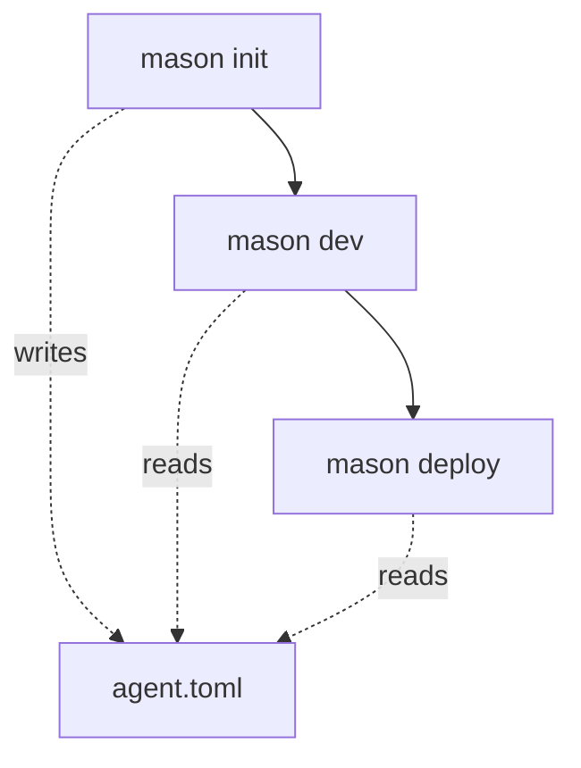

# Mason CLI

:::note[Experimental]

Mason and the custom agent APIs it uses are experimental. Commands and behavior can change.

:::

Mason (`databricks-mason`) is a Databricks command-line tool for building and deploying custom agents. It manages memory, sessions, tracing, tools, and deployments from one authenticated command, and includes a Python SDK.

## The Mason agent lifecycle

The Mason CLI scaffolds a local directory of deployable agent code from a framework template, with the runtime, tests, and an optional chat UI already wired up. You write the application logic (model, tools, and prompts), and Mason handles running it locally and deploying it to Databricks infrastructure.

`agent.toml` is the declarative source of truth for all Databricks-managed resources your agent depends on: tool bindings (data sandbox, managed MCP services, Unity Catalog functions), and memory, session, and tracing resources. `mason deploy` reads it to provision and wire everything up, so the file, not hand-written setup code, is what deploys.

Three commands take an agent from a blank directory to production:

- **`mason init`** scaffolds the project from a bundled template, writes `agent.toml` with declared stores and tools, and optionally seeds a `.env` file with a Databricks profile so the project runs immediately with `mason dev`.
- **`mason dev`** runs the agent locally using the same `app.yaml` and environment that the Databricks agent runtime uses, so local behavior matches what ships. It validates bound stores and tools from `agent.toml`, connects the agent to Databricks model serving, and sends traces to a per-project MLflow experiment.
- **`mason deploy`** reads `agent.toml` to provision any declared-but-missing stores, grants the agent's service principal access to them, configures per-project MLflow tracing, and rolls out the deployment. When the deployment finishes, Mason returns the URL of your running agent.



:::note

You can add tools and bind memory and session stores at any time, not only at init. Use `mason tools add`, `mason memory bind`, and `mason sessions bind` to update your agent configuration between any of these steps.

:::

## Mason capabilities

| Capability           | Description                                                                                                                                                                                                                                      |
| -------------------- | ------------------------------------------------------------------------------------------------------------------------------------------------------------------------------------------------------------------------------------------------ |
| **Model access**     | Mason automatically provisions model access so your agent can call a Databricks-served model without managing credentials or endpoints. See [Foundation Model APIs](https://docs.databricks.com/aws/en/machine-learning/foundation-model-apis/). |
| **Managed memory**   | Long-term memories that an agent can write and search, partitioned by actor and backed by managed stores. Use memory to persist facts and preferences across sessions.                                                                           |
| **Managed sessions** | Conversation transcripts held in managed session stores and partitioned by actor, with support for forking sessions into independent copies.                                                                                                     |
| **Tools**            | Databricks-managed capabilities declared in `agent.toml`: a downscoped Unity Catalog sandbox, a Databricks-managed MCP service, or a Unity Catalog function. Write custom Python tools directly in the project code.                             |
| **Tracing**          | MLflow tracing that is on by default, routing each run's traces to a per-project MLflow experiment for debugging and monitoring. See [MLflow Tracing](https://docs.databricks.com/aws/en/mlflow3/genai/tracing/).                                |
| **Deployment**       | Deploys an agent to the Databricks agent runtime, grants the agent's service principal access to bound stores, and manages the deployment lifecycle.                                                                                             |

## Quickstart

This quickstart takes you from an empty directory to a deployed custom agent.

### Prerequisites

- The [Databricks CLI](/docs/tools/databricks-cli), installed and [authenticated](/docs/tools/databricks-cli#authenticate) to your workspace.
- Python and `pip`.
- Install Mason:

  ```bash
  pip install databricks-mason
  ```

### Step 1: Authenticate with OAuth and save a profile

Mason uses Databricks CLI authentication. Authenticate to your workspace with OAuth (user-to-machine) and save the credentials as a named profile.

To start the OAuth flow, run the following, replacing the host with your workspace URL. The command opens a browser to complete sign-in, then writes the profile to `~/.databrickscfg`:

```bash
databricks auth login --host https://<your-workspace-url> --profile <profile>
```

To set that profile as Mason's default so later commands can omit `--profile`, run the following:

```bash
mason login --profile <profile>
```

`mason login` validates the profile's credentials. If they are missing or rejected, Mason reruns `databricks auth login` and retries.

### Step 2: Scaffold the agent project

Scaffold a new agent project, and pass `--framework` to choose the template. This example uses the LangGraph template, which includes a browser chat app:

```bash
mason init --framework langgraph my-agent
cd my-agent
```

Mason writes the project's managed resources and tool bindings to `agent.toml` and template provenance to `.mason/project.toml`. Pass `--framework openai` instead to scaffold an OpenAI-based agent. To scaffold the API-only backend without the chat app, add `--disable-chat-app`.

### Step 3: Attach managed session and memory stores

Bind managed stores so your agent can persist conversation history and long-term memory. Each command records the store name in `agent.toml` and creates the store if it does not exist.

To bind a session store and a memory store, run the following:

```bash
mason sessions bind my-agent-sessions
mason memory bind my-agent-memory
```

### Step 4: View tracing

Tracing is on by default. `mason dev` and `mason deploy` automatically send traces to a per-project MLflow experiment that is created on first run.

To list traces after your agent has produced some, run the following:

```bash
mason tracing list
```

To pin a specific MLflow experiment, run `mason tracing configure --experiment <experiment-id>`. To turn tracing off, run `mason tracing disable`.

### Step 5: Run the agent locally

Run the agent on your machine to test it before you deploy.

```bash
mason dev
```

This starts a local server on port 8000 using the same command and environment as the Databricks agent runtime. Mason connects the agent to Databricks model serving so it can call the model locally. By default, the agent uses the `databricks-gpt-5-2` model. To use a different model, edit the `MODEL` value in `agent/agent.py`. Send requests to `http://localhost:8000` to interact with the agent.

### Step 6: Deploy the agent

Deploy the agent to the Databricks agent runtime. Mason provisions the bound stores, grants the agent's service principal access to them, and rolls out the deployment. The deployed agent is named `agent-mason-<name>`.

```bash
mason deploy my-agent
```

When the deployment finishes, Mason returns the deployment's URL. Open that URL to interact with your live agent, which is automatically connected to Databricks model serving. To manage the deployment afterward, use the `mason deployments` commands, such as `mason deployments logs` and `mason deployments stop`.

## Command reference

For the full, up-to-date command reference, including every command and flag, see the [Mason README](https://github.com/databricks/databricks-ai-bridge/blob/main/integrations/mason/README.md) on GitHub.

## Where to next

- [Databricks CLI](/docs/tools/databricks-cli) to install and authenticate the CLI that Mason builds on.
- [Custom agent endpoints](/docs/agents/custom-agents) to call a Knowledge Assistant, Supervisor Agent, or custom Python agent from an AppKit app.
- [Mason README](https://github.com/databricks/databricks-ai-bridge/blob/main/integrations/mason/README.md) for the SDK, durable runtime, and full command reference.
