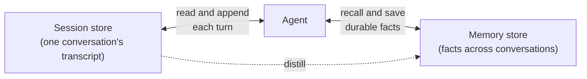

# Agent memory and sessions

:::note[Beta]

Managed agent memory and sessions are in [Beta](https://docs.databricks.com/aws/en/release-notes/release-types). APIs and behavior can change.

:::

Databricks gives agents two managed stores, both backed by [Lakebase](/docs/lakebase/overview) and usable from any framework:

- **Sessions** hold one conversation: the ordered messages, tool calls, and results the agent replays to continue it.
- **Memory** holds durable facts, such as a user's preferences, that the agent recalls in later, separate conversations with a natural-language search.

## Overview



A session grows within one conversation. When something in it is worth keeping, the agent or your app distills that fact into memory, which outlives the conversation. The stores are independent, so deleting a session never deletes memory.

### What sessions and memories contain

|               | Session                                                                                                                                     | Memory entry                                                                                                                      |
| ------------- | ------------------------------------------------------------------------------------------------------------------------------------------- | --------------------------------------------------------------------------------------------------------------------------------- |
| Lives in      | A session store                                                                                                                             | A memory store                                                                                                                    |
| Identified by | `actor_id` (who it belongs to) and a `session_id`, which the service generates if you omit it                                               | `actor_id`, a filesystem-like `path` such as `/preferences/contact.md`, and an optional `session_id` recording where it came from |
| Holds         | An ordered list of items. Each item is an opaque JSON value, such as a message, tool call, or tool result, and never changes once appended. | A free-form `content` string and a short `description` that improves retrieval                                                    |

### How they're saved and retrieved

|          | Save                                                                                                                | Retrieve                                                                                                                                                                                                        |
| -------- | ------------------------------------------------------------------------------------------------------------------- | --------------------------------------------------------------------------------------------------------------------------------------------------------------------------------------------------------------- |
| Sessions | Append items as the conversation runs.                                                                              | Read the items back in order at the start of each turn to rebuild context.                                                                                                                                      |
| Memory   | Add an entry when the agent learns something durable, from a model tool, your app code, or by distilling a session. | **List** an actor's entries, optionally filtered by `path` prefix or `session_id`, or **search** them with a natural-language query. Search ranks entries by full-text relevance (BM25), not vector similarity. |

## Creating a new agent with memory and sessions

To create a new agent with memory and sessions, scaffold it with the [Agent Bricks CLI](/docs/agents/cli), which wires in both stores for you. `agentbricks init` declares a `<directory>-memory` and a `<directory>-session` store in `agent.toml`, and `agentbricks deploy` creates them and grants the app's service principal access. To use stores you already have, bind them before you deploy:

```bash
agentbricks memory bind support-agent-memory
agentbricks sessions bind support-agent-sessions
```

The generated `agent/agent.py` wires them in through the AgentKit adapters. `memory_tools(actor)` gives the model `remember` and `recall` tools with the actor fixed in code, so the model can't reach another actor's memory:

```python title="agent/agent.py" tab="LangGraph"
from databricks_agentkit.langgraph import checkpointer, memory_tools, thread_config

agent = create_agent(model=model, tools=[*memory_tools(actor)], checkpointer=checkpointer())
result = await agent.ainvoke(inputs, config=thread_config(session_id, actor))
```

```python title="agent/agent.py" tab="OpenAI Agents SDK"
from agents import Agent, Runner
from databricks_agentkit.openai import memory_tools, session_store

agent = Agent(name="Agent", model=model, tools=[*memory_tools(actor)])
result = Runner.run_streamed(agent, agent_input, session=session_store(session_id, actor))
```

Under `agentbricks dev`, sessions stay in the running process and memory is off. The stores are used only once you deploy.

Each request carries the conversation's `session_id` and an `actor` inside its `input` object. `actor` decides whose memory the agent uses; without it, memory is scoped to the one conversation. The scaffolded chat app sets `actor` to the signed-in user. When you call the agent from your own code, set it on your server from the verified user identity:

```bash
agentbricks --profile <profile> endpoint invoke agent-bricks-my-agent \
  --path /api/invocations \
  --json '{"id":"'"$(uuidgen)"'","input":{"session_id":"case-456","actor":"user-123","messages":[{"role":"user","content":"I prefer email."}]}}'
```

## Use the stores from any agent

For another framework, a backfill job, or an app in another language, call the stores directly with the AgentKit SDK (`pip install databricks-agentbricks`, Python 3.10+):

```python title="example.py"
from databricks.sdk import WorkspaceClient
from databricks_agentkit import AgentKitClient

agentkit = AgentKitClient(WorkspaceClient())

# Sessions: append each turn, then read the history back oldest first.
session_store = agentkit.session_stores.create("support-agent-sessions")
session = session_store.add(actor_id="user-123", session_id="case-456")
session.append_items([{"type": "message", "role": "user", "content": "I need help with my cluster."}])
history = [item.data for item in session.list_items(order_by="create_time asc")]

# Memory: save a durable fact, then recall it in a later conversation.
memory_store = agentkit.memory_stores.create("support-agent-memory")
memory_store.add(
    actor_id="user-123",
    path="/preferences/communication.md",
    content="Prefers email over phone.",
    description="Communication preferences",
)
results = memory_store.search(actor_id="user-123", query="communication preferences")
```

`list_items` returns newest first by default, so pass `order_by="create_time asc"` when you rebuild context. To let a model decide when to save and recall, wrap `add` and `search` as tools in your framework, binding `actor_id` in code.

Every operation is also a REST call under `/api/2.0/agents/session-stores` and `/api/2.0/agents/memory-stores`. When you create a store over REST, set its ID in the query string (`?session_store_id=<name>` or `?managed_memory_store_id=<name>`) so later paths can use the name. AppKit has no built-in integration, so call the REST API from your server code.

## Partition by actor, secure by store

Every memory search and list is scoped to one `actor_id`, so setting it to the signed-in user gives each user private memory. `actor_id` separates data but isn't access control: any principal that can reach a store can read every actor's entries.

- Set `actor_id` in trusted code from the verified user identity. Never let the model or the end user choose it.
- For strict isolation between tenants, use a separate store per tenant.
- A deployed agent runs as its app's service principal, not as you, so that principal needs access to each store. `agentbricks deploy` grants it automatically. If you deploy another way, grant it yourself with the service principal's application ID: `memory_store.grant_permission("<application-id>")`, and the same on the session store.

## Where to next

- [Agent Bricks CLI](/docs/agents/cli) to scaffold and deploy an agent with both stores.
- [Lakebase Agent Memory](/templates/lakebase-agent-memory) template to keep an AppKit chat app's history in your own Lakebase database instead.
- [Managed agent memory](https://docs.databricks.com/aws/en/agents/agent-memory/managed-memory) and [managed agent sessions](https://docs.databricks.com/aws/en/agents/agent-memory/managed-sessions) for the full reference and limits.
