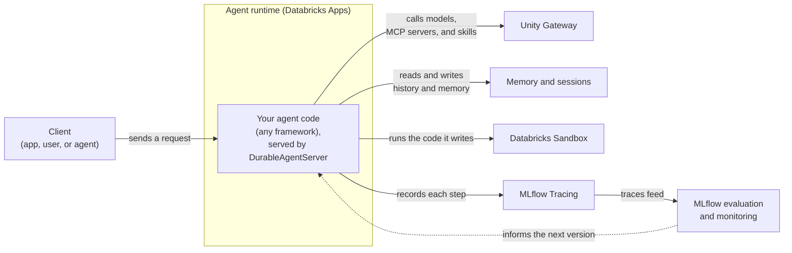

# What is Agent Bricks?

**Agent Bricks** is the Databricks developer platform for building and deploying custom agents that power your agentic products and workflows. You write the agent in code, with any framework or harness and any model. Agent Bricks provides the managed infrastructure the agent needs in production: hosting, durable execution, memory, tools, model access, tracing, and governance.

To build and deploy your first agent, see the [Agent Bricks quickstart](/docs/agents/quickstart). For full product documentation, see the [Databricks agents docs](https://docs.databricks.com/aws/en/agents/).

## What the platform gives you

Each building block is usable on its own, and the [Agent Bricks CLI](/docs/agents/cli) wires them together for a new project. The following diagram shows how a deployed agent uses them:

| You want to                             | Use                                                                                                                                                                                                                                                                                                                             |
| --------------------------------------- | ------------------------------------------------------------------------------------------------------------------------------------------------------------------------------------------------------------------------------------------------------------------------------------------------------------------------------- |
| Deploy your agent                       | The [agent runtime](/docs/agents/runtime) hosts any framework or harness, stateful or stateless. **`DurableAgentServer`** serves it with synchronous, streaming, and background runs, and recovers runs that a crash or restart interrupts.                                                                                     |
| Give your agent context                 | [Managed memory and sessions](/docs/agents/memory) for conversation history and long-term memory, plus Databricks-managed and external [MCP servers](https://docs.databricks.com/aws/en/agents/mcp-tools/) for tools and data.                                                                                                  |
| Run code safely                         | [Databricks Sandbox](/docs/agents/sandbox) gives the agent an isolated environment for the code it writes, with scoped access to governed data.                                                                                                                                                                                 |
| Connect to models                       | [Unity Gateway](/docs/unity-gateway/overview) gives one API for frontier and open models, so you can switch models without changing agent code.                                                                                                                                                                                 |
| Debug, evaluate, and monitor your agent | [MLflow Tracing](https://docs.databricks.com/aws/en/mlflow3/genai/tracing/overview) records each step the agent takes, locally and in production. [MLflow evaluation](https://docs.databricks.com/aws/en/mlflow3/genai/eval-monitor/) scores the agent's quality on test data before you deploy and on production traces after. |
| Govern what your agent can do           | [Unity Gateway](/docs/unity-gateway/overview) governs access to models, MCP servers, and skills, with guardrails, rate limits, and usage tracking. Unity Catalog governs the data the agent reads.                                                                                                                              |

## Agent lifecycle

Building a production agent is iterative. Start with the simplest agent that works, measure it, and improve it in small steps:

1. **Start a project.** Scaffold a new agent from a framework template with `agentbricks init`, or bring an agent you already built with LangGraph or the OpenAI Agents SDK. See [Agent Bricks CLI](/docs/agents/cli).
2. **Write the agent loop.** Put your prompts, tools, and orchestration in the framework code. Call models through [Unity Gateway](/docs/unity-gateway/overview), so you can switch models later without changing the agent.
3. **Give the agent context.** Add [memory and sessions](/docs/agents/memory) for conversation history and long-term memory, and add tools such as MCP servers, Genie Agents, and Unity Catalog functions with `agentbricks tools add`.
4. **Run and debug locally.** Run the agent with `agentbricks dev`, send it real requests, and read its [traces](https://docs.databricks.com/aws/en/mlflow3/genai/tracing/overview) to see each model and tool call.
5. **Evaluate.** Collect example requests and expected answers, then [evaluate the agent](https://docs.databricks.com/aws/en/mlflow3/genai/eval-monitor/) with MLflow to measure the effect of each change to prompts, tools, or models.
6. **Deploy.** Deploy the agent to the [agent runtime](/docs/agents/runtime) with `agentbricks deploy`, which creates the stores and tools the agent declares and grants the agent access to them.
7. **Monitor and improve.** Review production traces, [monitor quality](https://docs.databricks.com/aws/en/mlflow3/genai/eval-monitor/production-monitoring) with scorers, and add what you learn to your evaluation data. Then repeat from step 2 and redeploy.

## Agent Bricks, AppKit agents, and Omnigent

Databricks offers three ways to work with agents. They solve different problems, and they combine:

|               | Agent Bricks                                                          | AppKit agents plugin                                          | Omnigent                                                              |
| ------------- | --------------------------------------------------------------------- | ------------------------------------------------------------- | --------------------------------------------------------------------- |
| What it is    | A platform for building and deploying standalone custom agents        | Agents that you declare in your AppKit app's code             | One interface for Codex, Claude Code, Cursor, and other coding agents |
| Where it runs | Its own Databricks app on the agent runtime                           | In your app's runtime, at the app's built-in routes           | On your machine or in the cloud                                       |
| Who uses it   | Any app, service, user, or agent, through its HTTP API                | Your app's users, through the app's UI                        | You and your teammates, while you build                               |
| Use it when   | The agent is a product of its own, or many apps and services share it | The agent is a feature of one app and works on the app's data | You want coding agents to help you build an app or an agent           |

- To add an agent to an app you're building, see [Agentic features](/docs/apps/agentic-features). An AppKit app can also call an Agent Bricks agent through its HTTP API.
- To build an Agent Bricks agent with coding agents, use [Omnigent](/docs/omnigent/overview) as your development environment. Omnigent doesn't host the agent: you deploy it to the agent runtime.

For how all the Databricks developer services fit together, see [Platform overview](/docs/platform-overview).

## Where to next

- [Agent Bricks quickstart](/docs/agents/quickstart) to build and deploy your first agent in a few commands.
- [Agent Bricks CLI](/docs/agents/cli) to develop a new agent or bring an existing one, step by step.
- [Deploy agents on the agent runtime](/docs/agents/runtime) to serve an agent with `DurableAgentServer` and run it in production.
- [Agent memory and sessions](/docs/agents/memory) to give an agent conversation history and long-term memory.
- [Databricks Sandbox](/docs/agents/sandbox) to run agents and AI-written code in an isolated, persistent environment.
- [Unity Gateway](/docs/unity-gateway/overview) for governed access to models, MCP servers, and skills.
- [Omnigent](/docs/omnigent/overview) to develop agents with coding agents in one interface.
