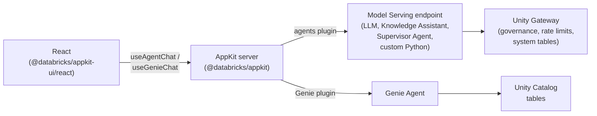

# What is Agent Bricks?

**Agent Bricks** is Databricks' enterprise agent platform for building, deploying, and governing agents that operate on your business data. It unifies model access, execution, governance, and context across a single system: from the model you call, to the data your agent reads, to the identity it acts under. In your workspace you configure Knowledge Assistants, Supervisor Agents, and custom Python agents. Databricks handles evaluation, tuning, and quality improvement, then hosts each agent at an HTTP endpoint your app can call.

For what Agent Bricks is and how to build with it, see the [Databricks agents docs](https://docs.databricks.com/aws/en/agents/) or the [`databricks-agent-bricks`](/docs/tools/ai-tools/agent-skills) agent skill.

Your AppKit app connects to Agent Bricks capabilities through the [agents plugin](/docs/appkit/v0/plugins/agents) for agents, foundation models, and governed endpoints, and the [Genie plugin](/docs/appkit/v0/plugins/genie) for natural-language queries over Unity Catalog tables.

## How it fits together

Your AppKit app calls Agent Bricks through a **Model Serving endpoint** (a foundation model, Knowledge Assistant, Supervisor Agent, or custom Python agent) or a **Genie Agent** (natural-language queries over Unity Catalog tables). The [agents plugin](/docs/appkit/v0/plugins/agents) (backing an agent with the endpoint) and the [Genie plugin](/docs/appkit/v0/plugins/genie) cover both.

## AppKit plugins for Agent Bricks

| You want to                                                                   | Use this plugin | Frontend helper             |
| ----------------------------------------------------------------------------- | --------------- | --------------------------- |
| Call a foundation model (LLM) with chat messages                              | `agents`        | `useAgentChat`              |
| Call an agent endpoint (Knowledge Assistant, Supervisor Agent, custom Python) | `agents`        | `useAgentChat`              |
| Give users natural-language queries over Unity Catalog tables                 | `genie`         | `GenieChat`, `useGenieChat` |

Pick the plugin that matches the resource. No other primitive is required for the AI surface.

> The `serving()` Model Serving plugin can also call a serving endpoint, but it's deprecated as of AppKit 0.77.0 in favor of the `agents` plugin, so these docs use `agents`. Back an agent with `DatabricksAdapter.fromModelServing` rather than registering `serving()`.

## Auth

Genie routes run on behalf of the authenticated user (OBO) by default, so a user without `CAN RUN` on the Genie Agent gets a 403; you don't write the permission check. The agents plugin's model call runs as the app service principal by default, while the plugin tools an agent calls run on behalf of the signed-in user.

For server logic outside the built-in routes, invoke the agent server-side with `runAgent`. See the [agents plugin reference](/docs/appkit/v0/plugins/agents).

## Why AppKit instead of raw `fetch`

You could call a serving endpoint directly with `fetch` and a token. The plugin isn't doing something you can't do yourself. It's doing these things so you don't have to:

- OBO where it applies: Genie routes and the plugin tools an agent calls run as the authenticated user, so **per-user permissions** apply automatically. Users only see data they're already allowed to see, with no OAuth code on your side. See [Execution context](/docs/appkit/v0/plugins/execution-context) for the details.
- All **streaming** is handled for you. SSE parsing, abort on unmount, token accumulation, and error handling. `useAgentChat` and `useGenieChat` do this.
- No **secrets** in the frontend. The plugin proxies through your server and tokens stay on the backend. No PAT in the React bundle.
- The `useAgentChat` hook exposes the stream as OpenAI Responses-shaped events, accumulating the assistant's text for you so you render `content` instead of parsing raw SSE chunks.

:::note[Creating a custom agent]

Creating a custom agent is a Python workflow: the `ResponsesAgent` interface, an agent framework (OpenAI Agents SDK, LangGraph, LlamaIndex), and MLflow for tracing. See [Author an AI agent](https://docs.databricks.com/aws/en/agents/custom-agents/author-agent).

:::

## Pick a template to start from

Start from a template that matches your use case. Each one includes the plugin wiring, an `app.yaml` resource binding, and a working UI you can adapt.

| You want to...                                     | Template                                                   |
| -------------------------------------------------- | ---------------------------------------------------------- |
| Add a streaming chatbot to your app                | [AI Chat App](/templates/ai-chat-app)                      |
| Let users query tables in natural language         | [Genie Analytics App](/templates/genie-analytics-app)      |
| Add multi-agent Genie switching to an existing app | [Genie Multi-Agent Selector](/templates/genie-multi-space) |

## Where to next

- [Unity Gateway](/docs/unity-gateway/overview) for governed access to models, agent endpoints, and external tools.
- [Agent memory and sessions](/docs/agents/memory) to give an agent conversation history and long-term memory.
- [Databricks Sandbox](/docs/agents/sandbox) to run agents and AI-written code in an isolated, persistent environment.
- [Genie Agents](/docs/lakehouse/genie) for chat-with-your-data over Unity Catalog tables.
- [Custom agent endpoints](/docs/agents/custom-agents) for wiring Knowledge Assistant, Supervisor Agent, or your own Python agent.
