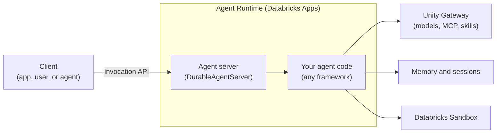

# What is Agent Bricks?

**Agent Bricks** is the Databricks developer platform for building and deploying custom agents that power your agentic products and workflows. You write the agent in code, with any framework or harness and any model. Agent Bricks provides the managed infrastructure the agent needs in production: hosting, durable execution, memory, tools, model access, tracing, and governance.

For full product documentation, see the [Databricks agents docs](https://docs.databricks.com/aws/en/agents/).

## What the platform gives you

Each building block is usable on its own, and the [Agent Bricks CLI](/docs/agents/cli) wires them together for a new project.

| You want to                   | Use                                                                                                                                                                                                                            |
| ----------------------------- | ------------------------------------------------------------------------------------------------------------------------------------------------------------------------------------------------------------------------------ |
| Deploy your agent             | **Agent Runtime** hosts any framework or harness, stateful or stateless. **`DurableAgentServer`** serves it with synchronous, streaming, and background runs, and recovers runs that a crash or restart interrupts.            |
| Give your agent context       | [Managed memory and sessions](/docs/agents/memory) for conversation history and long-term memory, plus Databricks-managed and external [MCP servers](https://docs.databricks.com/aws/en/agents/mcp-tools/) for tools and data. |
| Run code safely               | [Databricks Sandbox](https://docs.databricks.com/aws/en/compute/serverless/sandbox) gives the agent an isolated environment for the code it writes, with scoped access to governed data.                                       |
| Connect to models             | [Unity Gateway](/docs/unity-gateway/overview) gives one API for frontier and open models, so you can switch models without changing agent code.                                                                                |
| Debug and test your agent     | [MLflow Tracing](https://docs.databricks.com/aws/en/mlflow3/genai/tracing/overview) records each step the agent takes, locally and in production.                                                                              |
| Govern what your agent can do | [Unity Gateway](/docs/unity-gateway/overview) governs access to models, MCP servers, and skills, with guardrails, rate limits, and usage tracking. Unity Catalog governs the data the agent reads.                             |

## The agent compute stack

A deployed agent has three layers. Your **framework or harness** runs the agent loop. An **agent server** wraps that loop in an HTTP server and handles durability. The **agent runtime** runs the agent server on managed compute.



| Layer                | What it does                                                               | On Databricks                                                                                                        |
| -------------------- | -------------------------------------------------------------------------- | -------------------------------------------------------------------------------------------------------------------- |
| Framework or harness | Runs the agent loop: calls models and tools and decides what to do next.   | Any framework, such as LangGraph or the OpenAI Agents SDK, or [Omnigent](/docs/omnigent/overview) as a meta-harness. |
| Agent server         | Serves the invocation API, tracks each run, and recovers interrupted runs. | `DurableAgentServer`, or your own HTTP server.                                                                       |
| Agent runtime        | Runs the agent server with hosting, identity, and scaling.                 | Agent Runtime, which runs on [Databricks Apps](/docs/apps/overview).                                                 |

The [runtime guide](https://github.com/databricks/databricks-ai-bridge/blob/main/integrations/agentbricks/src/databricks_agentkit/runtime/README.md) covers `DurableAgentServer` handlers, run state, and recovery in detail.

## Build and deploy your first agent

:::note[Experimental]

The Agent Bricks CLI is experimental. Commands and behavior can change.

:::

To scaffold a LangGraph agent, run it locally, and deploy it, run the following:

```bash
pip install databricks-agentbricks
agentbricks login --profile <profile>
agentbricks init --framework langgraph my-agent
cd my-agent
agentbricks dev
agentbricks deploy my-agent
```

`agentbricks init` scaffolds the project and writes `agent.toml`, the file that records the managed resources the agent uses: memory and session stores, tools, and tracing. `agentbricks dev` runs the agent locally on the same server it uses when deployed. `agentbricks deploy` creates the declared resources, grants the agent access to them, and deploys it to Agent Runtime as an app named `agent-bricks-my-agent`.

To move an agent you already built with LangGraph or the OpenAI Agents SDK, run `agentbricks init --framework <langgraph|openai> --existing .` in its directory. The CLI prepares migration instructions for a coding agent to follow, and doesn't change your code itself.

For prerequisites, authentication, and each step in detail, see [Agent Bricks CLI](/docs/agents/cli).

## Query a deployed agent

`DurableAgentServer` serves the invocation API at `/api/invocations`. Each request needs a UUID `id`, which also makes retries safe, and a `session_id` that groups requests into one conversation. To send a request to the deployed agent from your terminal, run the following:

```bash
agentbricks --profile <profile> endpoint invoke agent-bricks-my-agent \
  --path /api/invocations \
  --json "{\"id\":\"$(uuidgen)\",\"session_id\":\"$(uuidgen)\",\"input\":[{\"role\":\"user\",\"content\":\"Hello\"}]}"
```

The command authenticates with your CLI profile and returns the agent's output. To stream the response, add `"stream":true` to the request body and pass `--sse`. To call the agent from your own code, send the same request to `<app-url>/api/invocations` with a Databricks OAuth token. Personal access tokens don't work for Databricks Apps.

## Identity and permissions

A deployed agent runs as the **service principal of its app**.

- `agentbricks deploy` grants the service principal access to the agent's memory, session, and run state stores.
- Tools that you add with `agentbricks tools add` run **on behalf of the user** who sent the request by default. Pass `--auth app` to run a tool as the service principal instead.
- Deploy grants the service principal access only to resources that `agent.toml` declares directly. Grant access to anything those resources use, such as the tables behind a tool, yourself.

## Where to next

- [Agent Bricks CLI](/docs/agents/cli) to scaffold, run, and deploy an agent step by step.
- [Agent memory and sessions](/docs/agents/memory) to give an agent conversation history and long-term memory.
- [Unity Gateway](/docs/unity-gateway/overview) for governed access to models, MCP servers, and skills.
- [Omnigent](/docs/omnigent/overview) to develop agents with coding agents in one interface.
