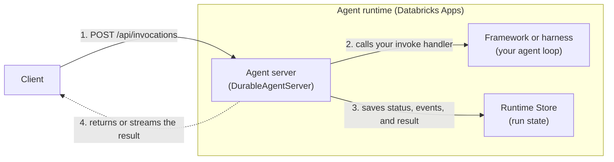

# Deploy agents on the agent runtime

To run an agent in production, deploy its code to managed compute that serves requests from your users and applications. The **agent runtime** hosts the agent on Databricks Apps, and **`DurableAgentServer`** serves it through the invocation API, with persistent run state and crash recovery. Agents that you create with the [Agent Bricks CLI](/docs/agents/cli) use both by default.

## The agent compute stack

A deployed agent has three layers, and each layer wraps the one above it:



1. A client sends a request to the agent server's invocation API.
2. The agent server calls your invoke handler, which runs the agent loop in your framework.
3. While the run is in progress, the agent server saves its status, heartbeats, events, and result to the Runtime Store. Clients use that record to check status or reconnect to a stream, and the server uses it to [recover runs](#crash-recovery) that a crash interrupts.
4. The agent server returns the result to the client, or streams events as the run produces them.

| Layer                | What it does                                                                          | Options on Databricks                                                                                            |
| -------------------- | ------------------------------------------------------------------------------------- | ---------------------------------------------------------------------------------------------------------------- |
| Framework or harness | Runs the agent loop: calls models and tools and decides what to do next.              | LangGraph, the OpenAI Agents SDK, any other framework, or [Omnigent](/docs/omnigent/overview) as a meta-harness. |
| Agent server         | Wraps the loop in an HTTP server, exposes the invocation API, and handles durability. | `DurableAgentServer` (recommended), or your own server with `agentbricks init --server custom`.                  |
| Agent runtime        | Runs the agent server on managed compute and handles hosting, identity, and scaling.  | The Databricks agent runtime, on [Databricks Apps](/docs/apps/overview).                                         |

Agents built with the MLflow `AgentServer` or `LongRunningAgentServer`, or deployed to Model Serving, are legacy. Use `DurableAgentServer` and the agent runtime for new agents.

## Serve your agent with `DurableAgentServer`

`DurableAgentServer` is part of the AgentKit library, `databricks_agentkit`, which ships in the `databricks-agentbricks` package (Python 3.10+). `agentbricks init` generates the server entrypoint for you, so you usually edit only the framework code in `agent/`. To bring your own agent loop, create the server and register one async invoke handler:

```python title="runtime/main.py"
from databricks_agentkit import DurableAgentServer, InvocationContext

app = DurableAgentServer()


@app.invoke
async def invoke(input, context: InvocationContext) -> dict:
    await context.emit({"type": "status", "message": "Looking that up"})
    answer = await run_my_agent(input, session_id=context.session_id)
    return {"answer": answer}
```

The handler receives the request's `input` and an `InvocationContext` (`invocation_id`, `session_id`, `attempt`, `is_recovery`, `emit`, `request_auth`), and returns any JSON-serializable value. The same handler serves every request mode. The client chooses whether to wait, stream, or run in the background. `DurableAgentServer` is a FastAPI app, so you can add your own routes with `@app.get(...)`.

### Invocation API

| Endpoint                                      | What it does                                                                                                                            |
| --------------------------------------------- | --------------------------------------------------------------------------------------------------------------------------------------- |
| `POST /api/invocations`                       | Starts an invocation and waits for the result. Set `stream` for Server-Sent Events, or `background` to return a status URL immediately. |
| `GET /api/invocations/<id>`                   | Returns the invocation's status and, after it completes, its output.                                                                    |
| `GET /api/invocations/<id>/events?after=<id>` | Streams stored events after an event ID, so a client can reconnect after a dropped connection.                                          |

- **Idempotency**: Clients send a UUID `id` with every invocation. Resending the same request returns the existing invocation instead of running the agent again. Reusing an ID for a different request returns `409`.
- **Sessions**: Invocations that share a `session_id` run one at a time, in order. The server passes it to your handler as `context.session_id`.

### Run state

`DurableAgentServer` stores each invocation's request, status, heartbeats, events, and result in a **Runtime Store**. `agentbricks dev` uses an in-process store, so run state is lost when the process stops. `agentbricks deploy` provisions a persistent Runtime Store in Lakebase, gives the app's service principal ownership of it, and reuses it on redeploy. You don't create, bind, or grant it yourself. The Runtime Store is separate from the [memory and session stores](/docs/agents/memory) your agent uses for conversation history.

### Crash recovery

To recover runs that a worker crash, restart, or redeploy interrupts, register a recovery handler:

```python title="runtime/main.py"
@app.recover
async def recover(input, context: InvocationContext) -> dict:
    # Resume from the last checkpoint in the session store, or replay if safe.
    return await resume_my_agent(input, session_id=context.session_id)
```

When a run's heartbeats stop, the deployed server starts a replacement attempt on an available worker within seconds and calls the recovery handler with the original input. Without a recovery handler, automatic recovery is off.

- Recovery covers interrupted workers, not errors. If your handler raises, the invocation fails and isn't retried.
- The server doesn't cap attempts. Check `context.attempt` and raise to stop.
- A replacement attempt can repeat side effects from the interrupted one, so make external calls idempotent.

Both CLI templates register a recovery handler: LangGraph resumes from its last checkpoint, and the OpenAI Agents SDK template replays the request in the same session.

## Deploy to the agent runtime

To deploy the agent, run the following from the project directory:

```bash
agentbricks --profile <profile> deploy my-agent
```

The command creates the memory and session stores, tools, and MLflow experiment that `agent.toml` declares, grants the app's service principal access to them, provisions the Runtime Store, and deploys the agent as a Databricks app named `agent-bricks-my-agent`. If it can't apply a required grant, it stops before uploading code and leaves the current deployment running.

To run more than one instance, pass `--instances` (1–5). Then send the session ID in an `X-Routing-Key` header, or with `--routing-key` in `agentbricks endpoint invoke`, so every request in a session reaches the same instance.

```bash
agentbricks --profile <profile> deploy my-agent --instances 2
```

To send requests to the deployed agent, see [Query the agent](/docs/agents/cli#step-6-query-the-agent).

### Manage deployments

| To                                   | Run                                                    |
| ------------------------------------ | ------------------------------------------------------ |
| List deployed agents                 | `agentbricks deployments list`                         |
| Get the URL and status               | `agentbricks deployments get agent-bricks-my-agent`    |
| Stream logs                          | `agentbricks deployments logs agent-bricks-my-agent`   |
| Stop or start the app                | `agentbricks deployments stop` / `start` with the name |
| Delete the app and its Runtime Store | `agentbricks deployments delete agent-bricks-my-agent` |

You can't change the agent server of an existing deployment. To switch between `DurableAgentServer` and your own server, create a new project with the `agentbricks init --server` option you want and deploy it under a new name.

## Identity and permissions

A deployed agent runs as the **service principal of its app**. Each tool call runs either as that service principal or **on behalf of the user** who sent the request.

### What deploy grants

`agentbricks deploy` grants the app's service principal access to the agent's memory and session stores and gives it ownership of the Runtime Store. It also grants access to the resources that app-identity tools declare directly in `agent.toml`, such as a Unity Catalog function, a Genie Agent space, or a sandbox's table, volume, and workspace path scopes.

- Deploy grants only resources that `agent.toml` declares directly. Grant access to anything those resources use yourself, such as the tables behind a Genie Agent or the objects a Unity Catalog function reads, when the tool runs as the service principal.
- The user or service principal that runs `agentbricks deploy` needs permission to create or manage the app, the declared stores, and the MLflow experiment, and to grant the resources that app-identity tools declare. If your tools need new Databricks Apps user scopes, pass `--allow-user-scope-update`.

### Which identity a tool uses

| Tool                                            | Runs as by default                    | To change it                                 |
| ----------------------------------------------- | ------------------------------------- | -------------------------------------------- |
| MCP service, sandbox, Genie One, or Genie Agent | The requesting user (`auth = "user"`) | Pass `--auth app` to `agentbricks tools add` |
| Unity Catalog function                          | The app's service principal           | Can't run as the user                        |
| Your own code                                   | The app's service principal           | Declare `[auth.user]` (see below)            |

Tools that run as the user need no grants for the service principal: each call uses the requesting user's own permissions.

### Act as the requesting user in your own code

To call Databricks as the requesting user from code you write, declare it in `agent.toml`, with any API scopes that Agent Bricks can't infer from your managed tools:

```toml title="agent.toml"
[auth.user]
required = true
additional_api_scopes = ["sql"]
```

Then get a client for the user inside the handler:

```python title="runtime/main.py"
user_client = context.request_auth.client_for("user")
me = user_client.current_user.me()
```

The server keeps the user's credential in memory for the active attempt only, so it can't recover an interrupted request-user invocation. Locally, `client_for("user")` uses your own credentials.

## Where to next

- [Agent Bricks quickstart](/docs/agents/quickstart) to build and deploy your first agent in a few commands.
- [Agent Bricks CLI](/docs/agents/cli) to scaffold, run, and deploy an agent step by step.
- [Agent memory and sessions](/docs/agents/memory) to give an agent conversation history and long-term memory.
- [Unity Gateway](/docs/unity-gateway/overview) for governed access to models, MCP servers, and skills.
- The [AgentKit runtime guide](https://github.com/databricks/databricks-ai-bridge/blob/main/integrations/agentbricks/src/databricks_agentkit/runtime/README.md) for the full handler and recovery reference.
